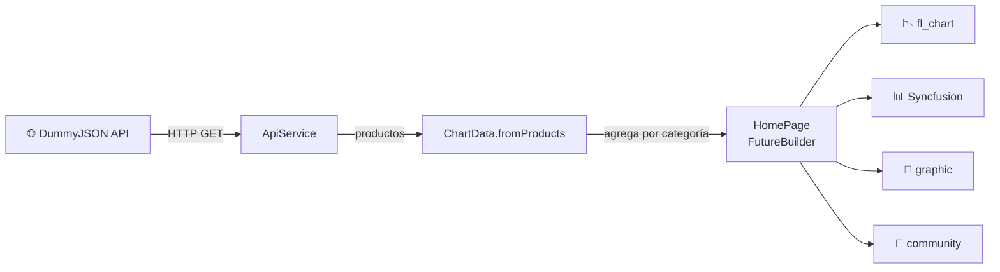

<div align="center">

# 📊 graficos_app

### Taller de gráficos en Flutter · 20 ejemplos con 4 librerías

Visualización de datos reales de la API pública **DummyJSON** usando
`fl_chart`, `Syncfusion`, `graphic` y `community_charts`.

<br/>


</div>

---

## 📑 Contenido

- [✨ Características](#-características)
- [📚 Librerías](#-librerías)
- [🚀 Cómo ejecutar](#-cómo-ejecutar)
- [🗂️ Estructura del proyecto](#️-estructura-del-proyecto)
- [🔄 Flujo de datos](#-flujo-de-datos)
- [🧪 Pruebas](#-pruebas)

---

## ✨ Características

| | |
|---|---|
| 🌐 **Datos reales** | Consume [`dummyjson.com/products?limit=100`](https://dummyjson.com/products?limit=100) (100 productos). |
| 📈 **20 gráficos** | Línea, barras, pastel, radar, dispersión, área, dona, barras radiales, apiladas y más. |
| 🗃️ **Agregación** | Estadísticas por categoría: cantidad, precio y rating promedio, stock total, descuento. |
| 🔁 **Recarga** | Botón en la barra superior para volver a consultar la API. |
| 🧩 **Arquitectura por capas** | Modelos, servicios, tema, widgets y páginas separados. |
| ✅ **Pruebas unitarias** | Modelos, agregación y `ApiService` con un cliente HTTP simulado. |

---

## 📚 Librerías

<div align="center">

| Pestaña | Librería | Gráficos | Paquete |
|:---:|:---|:---:|:---|
| 📉 | **fl_chart** | `1 – 5` | [](https://pub.dev/packages/fl_chart) |
| 📊 | **Syncfusion** | `6 – 10` | [](https://pub.dev/packages/syncfusion_flutter_charts) |
| 🍩 | **graphic** | `11 – 15` | [](https://pub.dev/packages/graphic) |
| 📶 | **community_charts** | `16 – 20` | [](https://pub.dev/packages/community_charts_flutter) |

</div>

---

## 🚀 Cómo ejecutar

> [!NOTE]
> Requiere **Flutter 3.29+** y conexión a internet (la app consulta la API al iniciar).

```bash
# 1. Instalar dependencias
flutter pub get

# 2. Ejecutar (web, Android, Windows...)
flutter run -d chrome

# 3. Correr las pruebas
flutter test
```

> [!TIP]
> En Android, el permiso `INTERNET` ya está declarado en `AndroidManifest.xml`.

---

## 🗂️ Estructura del proyecto

```text
lib/
├── main.dart                       # MaterialApp y tema
├── models/
│   ├── product.dart                # Product + fromJson
│   ├── category_stat.dart          # Estadísticas por categoría
│   ├── chart_data.dart             # ChartData + agregación por categoría
│   └── models.dart                 # Exporta los modelos
├── services/
│   └── api_service.dart            # Consumo de la API (http.Client inyectable)
├── theme/
│   └── palette.dart                # Paleta de colores compartida
├── widgets/
│   └── chart_card.dart             # Tarjeta: número, título, nivel y observación
└── pages/
    ├── home_page.dart              # Pestañas, FutureBuilder y recarga
    ├── fl_chart_page.dart          # Gráficos 1–5
    ├── syncfusion_page.dart        # Gráficos 6–10
    ├── graphic_page.dart           # Gráficos 11–15
    └── community_charts_page.dart  # Gráficos 16–20
test/
└── chart_data_test.dart            # Pruebas unitarias
```

<details>
<summary><b>🧱 ¿Qué hace cada capa?</b></summary>

<br/>

| Capa | Responsabilidad |
|---|---|
| `models/` | Clases de datos puras, sin dependencias de Flutter. |
| `services/` | Comunicación HTTP con la API; el cliente se puede inyectar para pruebas. |
| `theme/` | Colores compartidos por todos los gráficos. |
| `widgets/` | Componentes visuales reutilizables. |
| `pages/` | Pantallas: una por librería + la página principal con pestañas. |

</details>

---

## 🔄 Flujo de datos



1. `HomePage` llama una sola vez a `ApiService().fetch()`.
2. El servicio descarga los productos y construye `ChartData.fromProducts()`.
3. Cada página recibe `ChartData` y dibuja sus gráficos dentro de `ChartCard`.

> [!IMPORTANT]
> No hay backend propio: la app funciona completamente en el cliente y consume una API REST pública.

---

## 🧪 Pruebas

```bash
flutter test
```

| Prueba | Qué verifica |
|---|---|
| `Product.fromJson` | Conversión de números y título corto |
| `ChartData` | Agrupación, promedios, stock y orden por cantidad |
| `ApiService` (error) | Lanza excepción si la respuesta no es `200` |
| `ApiService` (ok) | Parsea correctamente la respuesta de la API |

---

<div align="center">

Hecho con 💙 y Flutter

</div>
